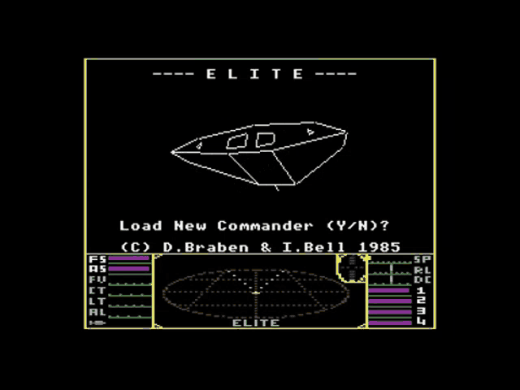
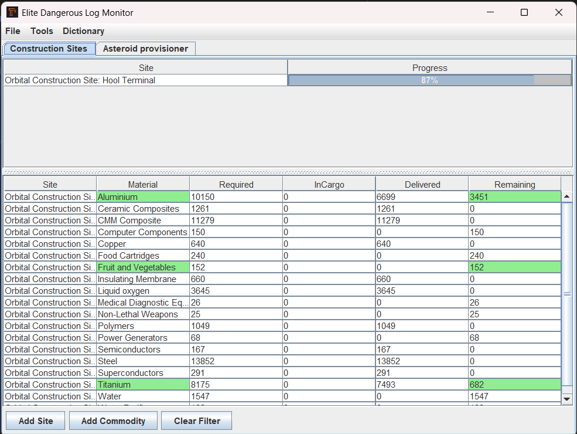
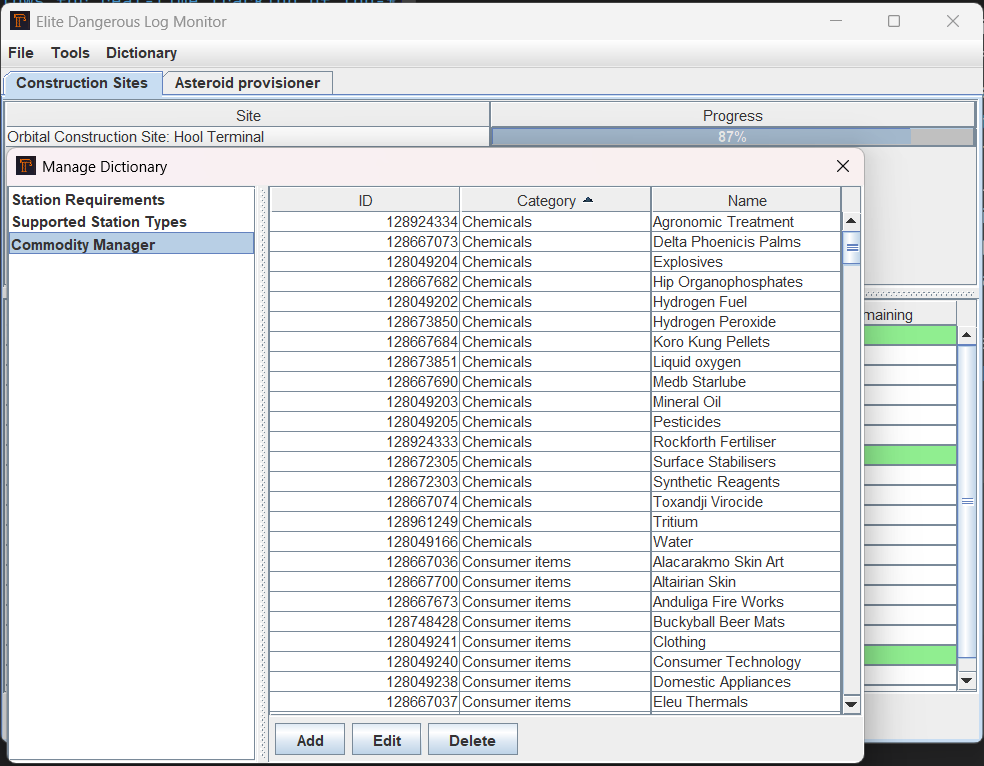
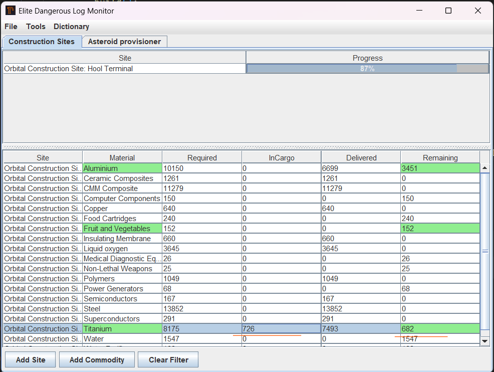

# ed-monitor: Advanced Desktop Application for File Monitoring and User Notifications
[](https://github.com/zzergAtStage/ed-monitor/actions/workflows/maven.yml)


# Overview

`ed-monitor` is a sophisticated desktop/server/api application developed in Java that has evolved
from a simple Swing-based interface to a comprehensive solution incorporating 
file monitoring, user notifications, and persistent market data management. 
This project reflects the progressive enhancement of Java application and its capabilities, 
integrating popular frameworks and adhering to established architectural patterns
to ensure resilience and scalability.

# Features

* File Monitoring: Utilizes Java NIO's WatchService API to efficiently monitor directory and file changes, 
including creation, modification, and deletion events. This allows for real-time tracking of log-files activities.

* User Notifications: Implements a robust notification system that alerts users to specific events or
changes within the application. This feature enhances user engagement and responsiveness to critical updates.

* Persistent Market Data Management: Incorporates mechanisms for the persistent storage and retrieval 
of market data, ensuring data integrity and availability across sessions. This is particularly beneficial 
for applications requiring reliable data persistence.

* Modular Architecture: Designed with a modular approach, facilitating maintainability and extensibility. 
This architecture supports the seamless integration of additional features and components as the application evolves.
  ### Screenshoots



## Version updates
* **0.1.0**:
  - Reworked core systems, decoupled `ed-monitor-swing` from Spring, introduced 
[FileReadStrategy.java](ed-monitor-swing/src/main/java/com/zergatstage/monitor/service/readers/FileReadStrategy.java) for file monitoring,
  - added commodity tracker, match with docked market data, highlight required and presented commodities
  - added balanced ground of truth for cargo bay values tracking
  - 👉 Server mode for `ed-monitor-swing` is currently not supported, but can be implemented in future releases.
## To run ed-monitor on your local machine, follow these steps:

1. Clone the Repository:

```bash
git clone https://github.com/zzergAtStage/ed-monitor.git
```
2. Navigate to the Project Directory:

`cd ed-monitor`

3. Build the Project: Utilize your preferred build tool (e.g., Maven or Gradle) to compile the project. Ensure all dependencies are resolved during this process.

```bash
mvn clean install   
```
4. Run the Application: Execute the compiled JAR file to launch the application.  

```bash
mvn exec:java
```

5. To run tests   
```bash
mvn clean test -Ptest  
```

## Prerequisites

* Java Development Kit (JDK): Ensure JDK 17(22 for lastest releases) or higher is installed on your system.

* Build Tool: Maven is required for building the project.
```bash
mvn package -Dmaven.test.skip
mvn spring-boot:run # for server mode
```

# Usage

Upon launching ed-monitor, users can configure monitoring parameters, set up notification preferences, 
and manage market data through an intuitive graphical user interface.

## Contributing

Contributions to ed-monitor are welcome. To contribute:

Fork the repository.
Create a new branch for your feature or bug fix.
Commit your changes with clear and concise messages.
Submit a pull request detailing the modifications and their purposes.

## License

This project is licensed under the [MIT License](./license/license.txt). For more information, refer to the LICENSE file in the repository.

### Acknowledgements

Gratitude is extended to the open-source community and the developers of the frameworks and libraries utilized in this project. Their contributions have been instrumental in the development and enhancement of ed-monitor.

### Contact

For inquiries, suggestions, or feedback, please contact the project maintainer at @zzergAtStage

