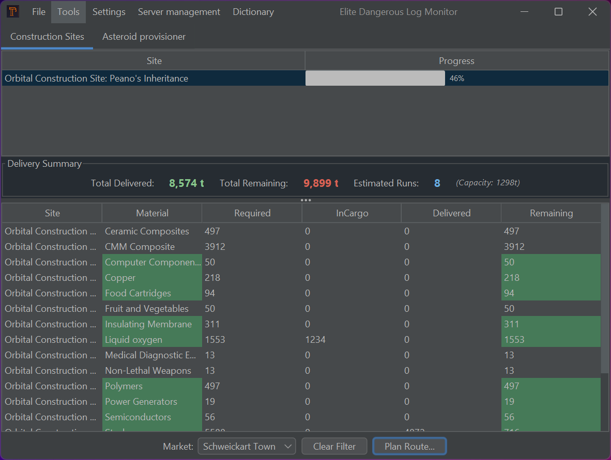
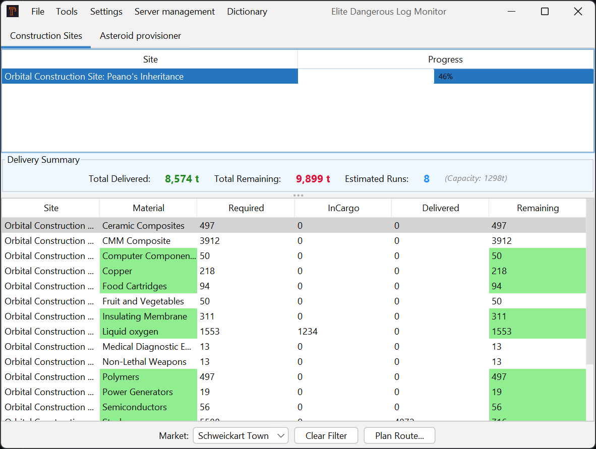
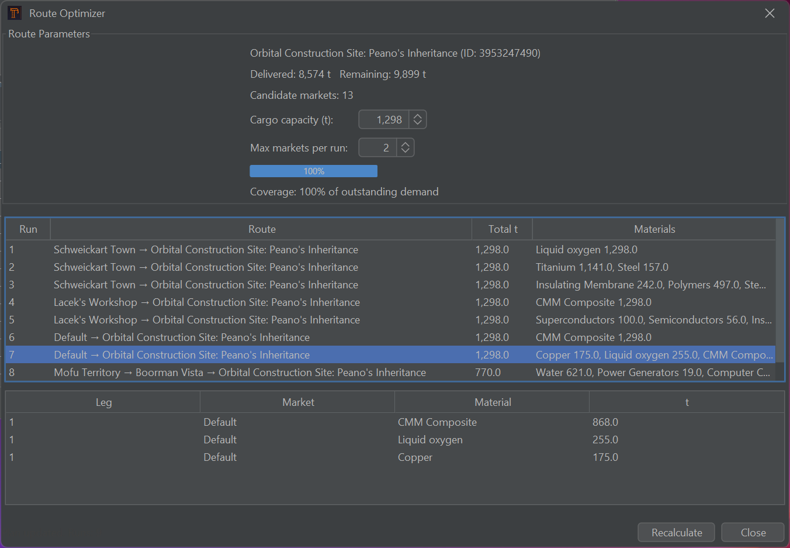
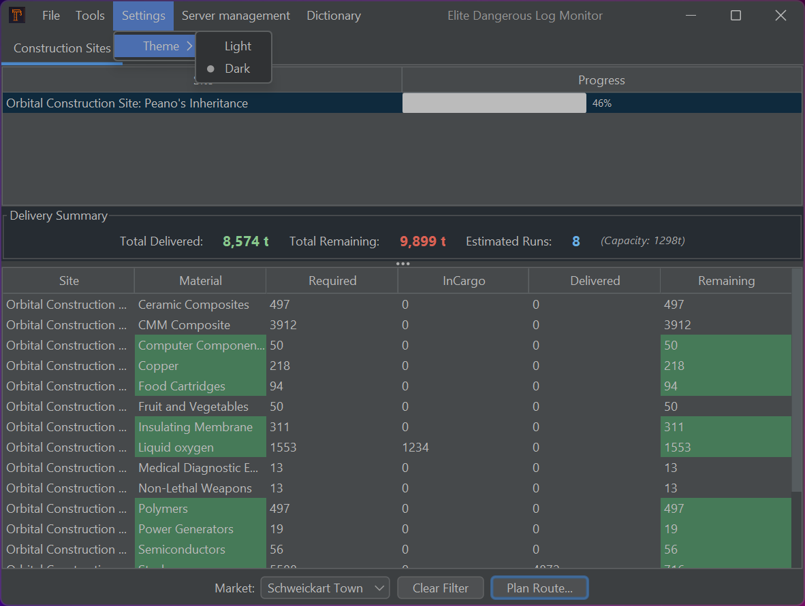
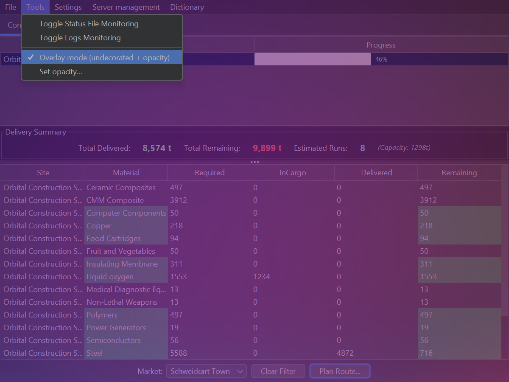
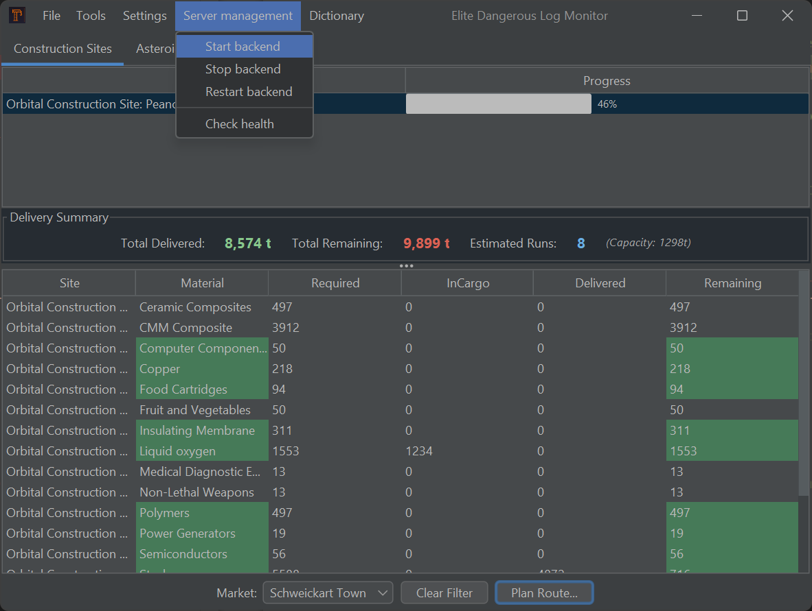

# ed-monitor: Advanced Desktop Application for File Monitoring, Route Planning, and User Notifications
[](https://github.com/zzergAtStage/ed-monitor/actions/workflows/maven.yml)


# Overview

`ed-monitor` is a multi-module Java desktop + server application that has grown from a Swing log monitor
into a full toolkit for Elite Dangerous commanders. It blends file monitoring, user notifications,
persistent market data, and an integrated route optimizer with modern dark/light theming and
cross-platform UX polish.

# Features

* File Monitoring: Utilizes Java NIO's WatchService API to efficiently monitor directory and file changes,
  including creation, modification, and deletion events. This allows for real-time tracking of log-file activities.

* User Notifications: Implements a robust notification system that alerts users to specific events or
  changes within the application. This feature enhances user engagement and responsiveness to critical updates.

* Persistent Market Data Management: Incorporates mechanisms for the persistent storage and retrieval
  of market data, ensuring data integrity and availability across sessions. This is particularly beneficial
  for applications requiring reliable data persistence.

* Route Optimizer: Plan multi-market delivery runs per construction site with capacity + max-market constraints,
  optimized legs, and candidate market filtering tied to required commodities.
* Modern Theming: FlatLaf-based dark/light themes with Windows 11 detection, runtime switching from Settings,
  and safe fallback when OS detection is unavailable. Immediate UI refresh across open windows.
* UX Shortcuts: Double-press `Esc` to minimize the main window; single `Esc` closes modals consistently.
* Modular Architecture: Designed with a modular approach, facilitating maintainability and extensibility.

### Screenshots (0.3.0)







### Route Optimizer at a Glance
- Load construction site context and candidate markets automatically.
- Tune cargo capacity and max markets per run; rerun with a click.
- View per-run leg breakdowns and material tonnage coverage.
- Built-in error surfacing and safer startup so the first plan is ready without manual retries.
## Version updates
* **0.1.0**:
  - Reworked core systems, decoupled `ed-monitor-swing` from Spring, introduced 
[FileReadStrategy.java](ed-monitor-swing/src/main/java/com/zergatstage/monitor/service/readers/FileReadStrategy.java) for file monitoring,
  - added commodity tracker, match with docked market data, highlight required and presented commodities
  - added balanced ground of truth for cargo bay values tracking
  - 👉 Server mode for `ed-monitor-swing` is currently not supported, but can be implemented in future releases.  

* **0.1.1**:
   - Added asteroid provisor: Track most valuable metals for mining
    - Displays metal proportions with color-coded highlighting (orange, violet, gray)
* **0.3.0 (current)**:
  - Added FlatLaf dark/light themes with Windows 11 startup detection, Settings toggle, preference persistence, and full UI refresh.
  - Elite-inspired highlighting for construction materials and delivery summaries in dark mode.
  - Global keybindings: double `Esc` to minimize main window; single `Esc` closes dialogs.
  - Route optimizer polish: ensures site context is set before planning to avoid false error popups; improved default run kick-off.
  - Updated shaded artifacts and server launcher paths to `0.3.0-SNAPSHOT`.
    
## To run ed-monitor on your local machine, follow these steps:

1. Clone the Repository:

```bash
git clone https://github.com/zzergAtStage/ed-monitor.git
```
2. Navigate to the Project Directory:

`cd ed-monitor`

3. Build the Project: Utilize your preferred build tool (e.g., Maven or Gradle) to compile the project. Ensure all dependencies are resolved during this process.

```bash
mvn clean install   
```
4. Run the Application: Execute the compiled JAR file to launch the application.  

```bash
mvn exec:java
```

5. To run tests   
```bash
mvn clean test -Ptest  
```

## Prerequisites

* Java Development Kit (JDK): Ensure JDK 21 or higher is installed on your system.

* Build Tool: Maven is required for building the project.
```bash
mvn package -Dmaven.test.skip
mvn spring-boot:run # for server mode
```

# Usage

Upon launching ed-monitor, users can configure monitoring parameters, set up notification preferences, 
and manage market data through an intuitive graphical user interface. Switch between dark/light themes from
Settings → Theme, double-press `Esc` to minimize the main window, and press `Esc` once to close dialogs.

## Market Data API (Server)

The server persists market data in H2 and exposes a minimal REST API:

- `POST /api/markets` — accepts an array of market objects, upserts by `marketId` and commodity `id`.
- `GET /api/markets` — returns all stored markets.
- `GET /api/markets/{id}` — returns a single market by `marketId`.
- `PUT /api/markets/{id}` — replaces a market by `marketId`.

Example H2 configuration is pre-set (H2 console enabled in prod profile). Default port is `8080`.

### Quick start

Run the server:

```
cd ed-monitor-server
mvn spring-boot:run -Dspring-boot.run.profiles=prod
```

Load sample market data:

```
curl -X POST http://localhost:8080/api/markets \
     -H "Content-Type: application/json" \
     -d @ed-monitor-server/src/main/resources/Market.json
```

List markets:

```
curl http://localhost:8080/api/markets
```

Update a market:

```
curl -X PUT http://localhost:8080/api/markets/3516841984 \
     -H "Content-Type: application/json" \
     -d '{"marketId":3516841984,"stationName":"Updated Station","stationType":"CraterPort","systemName":"Col 285 Sector LH-L c8-9","items":[]}'
```

## Swing client HTTP sync

The Swing client reads `Market.json` from the Elite Dangerous log directory and, on updates, posts parsed market data to the server using OkHttp.

- Configure server URL via `-Ded.server.baseUrl=http://localhost:8080` (or `ED_SERVER_BASE_URL` env var).
- On each file update, the client sends the parsed market to `POST /api/markets`.
- A lightweight `MarketDataHttpService` provides `postMarkets`, `getMarkets`, and `getMarket`.

Run Swing client fat jar:

```
cd ed-monitor-swing
mvn -q -DskipTests package
java -Ded.server.baseUrl=http://localhost:8080 -jar target/ed-monitor-swing-0.3.0.jar
```

## Contributing

Contributions to ed-monitor are welcome. To contribute:

Fork the repository.
Create a new branch for your feature or bug fix.
Commit your changes with clear and concise messages.
Submit a pull request detailing the modifications and their purposes.

## License

This project is licensed under the [MIT License](./license/license.txt). For more information, refer to the LICENSE file in the repository.

### Acknowledgements

Gratitude is extended to the open-source community and the developers of the frameworks and libraries utilized in this project. Their contributions have been instrumental in the development and enhancement of ed-monitor.

### Contact

For inquiries, suggestions, or feedback, please contact the project maintainer at @zzergAtStage

