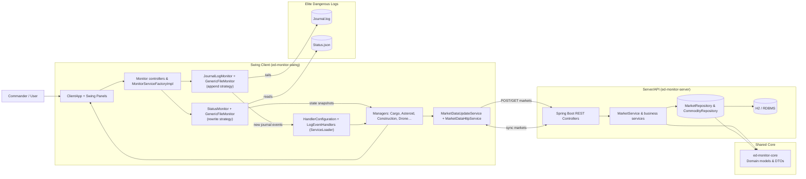

# arc diagram v2

```mermaid
flowchart LR
    U[Commander / User]
    subgraph "Swing Client (ed-monitor-swing)"
        UI[ClientApp + Swing Panels]
        Controller[Monitor controllers & MonitorServiceFactoryImpl]
        LogMon["JournalLogMonitor + GenericFileMonitor<br/>(append strategy)"]
        StatusMon["StatusMonitor + GenericFileMonitor<br/>(rewrite strategy)"]
        HandlerCfg["HandlerConfiguration + LogEventHandlers (ServiceLoader)"]
        Managers[Managers: Cargo, Asteroid, Construction, Drone…]
        HttpSvc[MarketDataUpdateService + MarketDataHttpService]
    end
    subgraph "Elite Dangerous Logs"
        Journal[(Journal.log)]
        Status[(Status.json)]
    end
    subgraph "Server/API (ed-monitor-server)"
        Rest[Spring Boot REST Controllers]
        Service[MarketService & business services]
        Repo[(MarketRepository & CommodityRepository)]
        DB[(H2 / RDBMS)]
    end
    subgraph "Shared Core"
        Core[ed-monitor-core<br/>Domain models & DTOs]
    end

    U --> UI
    UI --> Controller
    Controller --> LogMon
    Controller --> StatusMon
    LogMon -->|new journal events| HandlerCfg
    StatusMon -->|state snapshots| Managers
    HandlerCfg --> Managers
    Managers --> UI
    Managers --> HttpSvc
    LogMon -->|tails| Journal
    StatusMon -->|reads| Status

    HttpSvc -->|POST/GET markets| Rest
    Rest --> Service --> Repo --> DB
    Service --> Core
    Repo --> Core
    HttpSvc <-->|sync markets| Rest
```